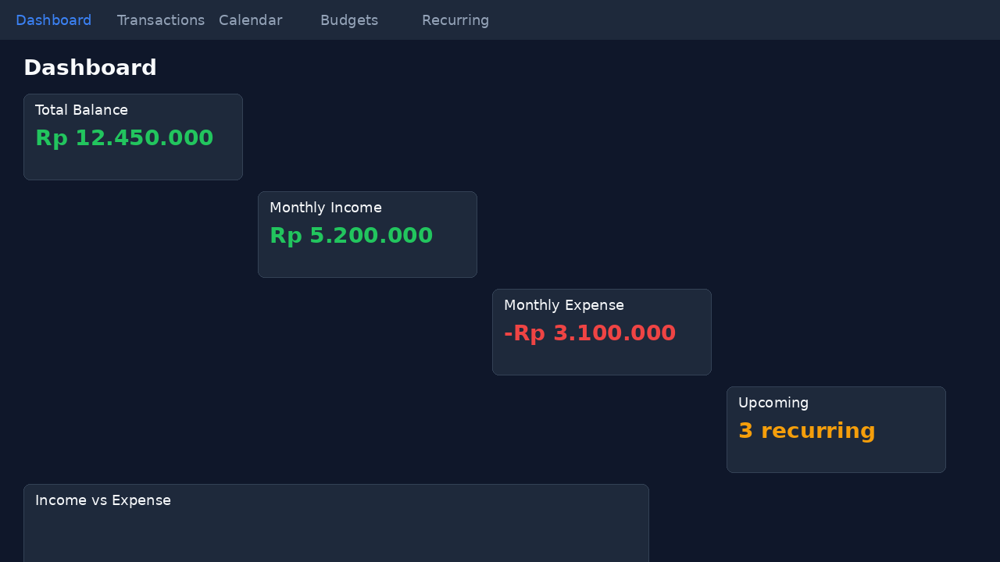
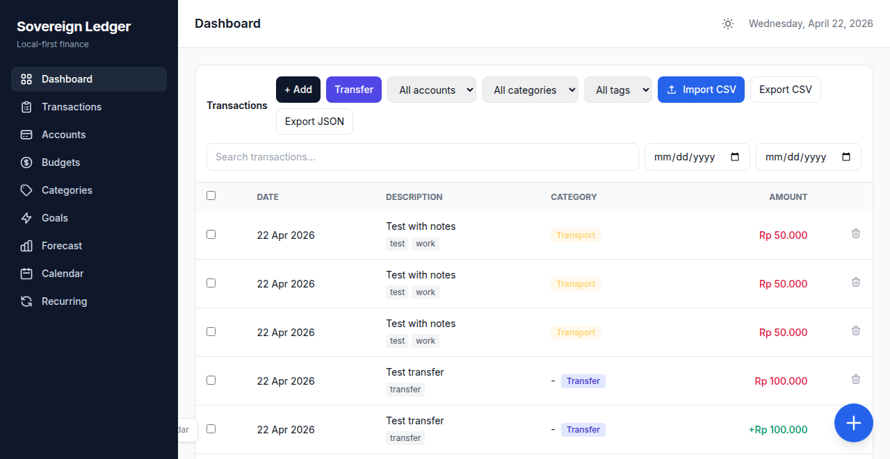
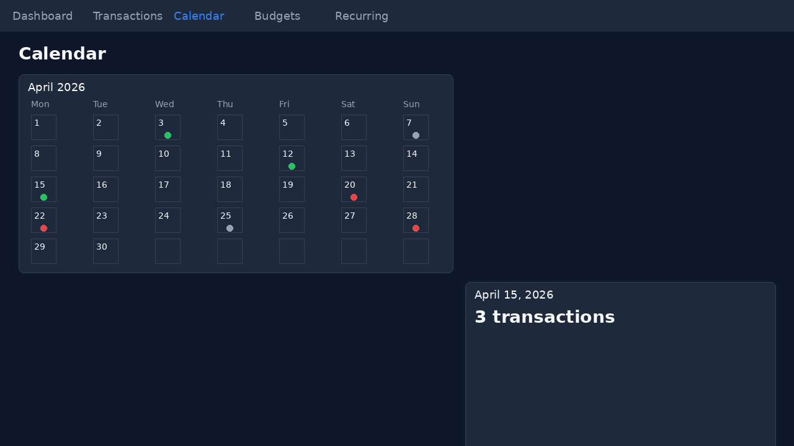
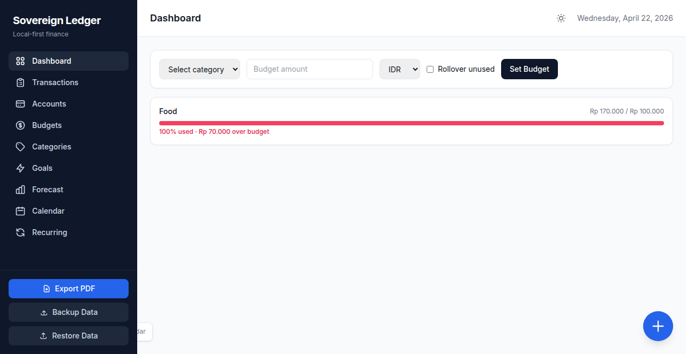

# Reign

**Local-first personal finance tracker.** No cloud, no subscriptions, no data leaks. Your money, your machine, your rules.


---

## Philosophy

Reign was built for one purpose: give you complete control over your financial data. Everything runs locally on your machine using a single SQLite file. No accounts to create, no API keys to manage, no vendor lock-in.

---

## Features

### Core
- **Multi-account management** — Track checking, savings, cash, investment accounts
- **Categories with auto-categorization** — Keyword-based transaction categorization
- **Multi-currency support** — IDR, USD, AUD (easily extensible)
- **Dark mode** — Full dark/light theme toggle

### Productivity
| # | Feature | Shortcut |
|---|---------|----------|
| 1 | **Keyboard Shortcuts** | `Ctrl+N` Add, `Ctrl+S` Save, `/` Search, `Esc` Close, `C` Calendar |
| 2 | **Transaction Templates** | Save frequent transactions to localStorage |
| 3 | **Quick Add** | Floating + button on every page |
| 4 | **Bulk Edit** | Select multiple rows → edit category/date at once |
| 5 | **CSV Import + Preview** | Preview first 10 rows before confirming import |
| 6 | **Multi-format Export** | CSV + JSON export buttons |

### Intelligence
| # | Feature | Details |
|---|---------|---------|
| 7 | **Recurring Transactions** | Full CRUD for monthly recurring entries |
| 8 | **Dashboard Activity Summary** | Stats + upcoming recurring list |
| 9 | **Transaction Notes & Tags** | Expandable notes, tag badges, tag-filtered search |
| 10 | **Budget Alerts** | Color-coded progress bars + dashboard banner when >90% spent |
| 11 | **Calendar Heatmap** | Monthly calendar with income/expense dots, click day for details |
| 12 | **Multi-Account Transfers** | Create linked debit/credit transfers excluded from summaries |

### Reporting
- **Monthly trend charts** — Income vs expense line chart
- **Category breakdown** — Doughnut chart of spending by category
- **3-month cash flow forecast** — Projection based on recurring transactions
- **PDF report generation** — One-click monthly PDF export
- **Backup & Restore** — Full JSON backup/restore of entire database

---

## Tech Stack

| Layer | Technology |
|-------|------------|
| Backend | FastAPI + async SQLAlchemy |
| Database | SQLite (local file) |
| Frontend | Vanilla JavaScript + Tailwind CSS + Chart.js |
| Package Manager | `uv` |

---

## Installation

### Prerequisites

Only one tool required: [**uv**](https://docs.astral.sh/uv/getting-started/installation/)

```bash
# macOS/Linux
curl -LsSf https://astral.sh/uv/install.sh | sh

# Windows (PowerShell)
powershell -c "irm https://astral.sh/uv/install.ps1 | more"
```

### Run from Source

```bash
# 1. Clone the repository
git clone https://github.com/rinopatrick/reign.git
cd reign

# 2. Run (uv automatically creates venv + installs deps)
uv run python -m reign

# 3. Open browser
# http://localhost:8000
```

That's it. No `pip install`, no `requirements.txt` manual setup. `uv` handles everything.

### Easy Launch (No Terminal Typing)

Don't want to type commands every time? Use the included launcher:

| OS | What to do |
|----|-----------|
| **Windows** | Double-click `start.bat` |
| **macOS / Linux** | Double-click `start.sh` (or right-click → Open) |

Both scripts will start the app and print the address. Just open `http://localhost:8000` in your browser.

> **Tip:** You can bookmark the address. The app stays running until you close the terminal window.

### Install as Tool (Advanced)

```bash
uv tool install git+https://github.com/rinopatrick/reign.git

# Then run anytime from anywhere:
reign
```

---

## Data Storage

Your data lives in a single SQLite file in the project directory:

```
reign/
├── reign.db          <-- Your data
├── backups/          <-- Auto-backups land here
├── src/
└── ...
```

- **Manual backup:** Click "Backup Data" in the sidebar → downloads `reign_backup_YYYY-MM-DD.json`
- **Scheduled backup:** Go to **Settings → Scheduled Backups** → enable auto-backup (daily / weekly / monthly). Backups are saved to the `backups/` folder automatically.
- **Restore:** Click "Restore Data" → select JSON backup file
- **Migrate:** The app auto-creates tables on first run. For schema upgrades, run:
  ```bash
  uv run python migrate.py
  ```

The database file is 100% portable. Copy it between devices, back it up to your cloud of choice, or version it with Git.

---

## Development

```bash
# Run tests
uv run pytest

# Type checking
uv run mypy src/reign

# Lint
uv run ruff check src/
```

---

## Architecture

```
reign/
├── src/reign/
│   ├── api/
│   │   ├── app.py              # FastAPI factory
│   │   ├── schemas.py          # Pydantic models
│   │   └── routes/             # Transaction, Budget, Dashboard, etc.
│   ├── adapters/
│   │   ├── database.py         # SQLAlchemy engine & session
│   │   └── repository.py       # Async repository layer
│   ├── domain/
│   │   └── models.py           # SQLAlchemy ORM models
│   ├── services/
│   │   ├── csv_parser.py       # Bank CSV auto-detection
│   │   ├── categorizer.py      # Keyword-based auto-categorization
│   │   └── pdf_generator.py    # Monthly report PDFs
│   └── static/
│       ├── index.html          # Single-page app shell
│       └── app.js              # All frontend logic (~1100 lines)
└── tests/
```

---

## Screenshots

| Dashboard | Transactions | Calendar |
|-----------|-------------|----------|
|  |  |  |

| Budgets |
|---------|
|  |

---

## Roadmap

- [ ] Bank statement import (OFX/QFX)
- [ ] Reconciliation with bank statements
- [ ] Multi-user support (local profiles)
- [x] **Scheduled backups** ✓
- [ ] Mobile PWA support
- [ ] Investment/Stock tracking
- [ ] Split transactions

---

## Support

If this tool saves you time or money, consider supporting its development:

| Platform | Link | Payment Methods |
|----------|------|----------------|
| **Saweria** (Indonesia) | [saweria.co/rinopatrick](https://saweria.co/rinopatrick) | QRIS, GoPay, OVO, Dana, LinkAja |
| **Ko-fi** (International) | [ko-fi.com/rinopatrick](https://ko-fi.com/rinopatrick) | PayPal, Credit Card |

Every cup of coffee helps keep this project alive and growing.

---

## License

MIT License. Your data, your rules.

---

## Credits

Built with:
- [FastAPI](https://fastapi.tiangolo.com/)
- [SQLAlchemy](https://www.sqlalchemy.org/)
- [Tailwind CSS](https://tailwindcss.com/)
- [Chart.js](https://www.chartjs.org/)
- [uv](https://docs.astral.sh/uv/)

---

**Reign** — *Finance without surveillance.*
